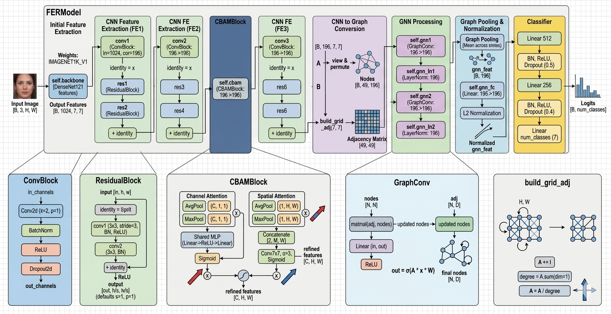

Facial expression recognition (FER) remains a challenging problem in affective compu-ting due to illumination variations, pose changes, and subtle inter-class similarities among expressions. This study aims to develop a lightweight yet accurate FER model capable of capturing both local facial features and global relational dependencies among facial regions. DRAG-Net, a Deep Residual Attention Graph Network, was proposed, integrating a pre-trained DenseNet121 backbone with attention-augmented residual learning and graph-structured relational reasoning. Feature maps produced by the backbone are refined through convolutional blocks with skip connections, en-hanced via a Convolutional Block Attention Module (CBAM) to emphasize expres-sion-relevant regions, and subsequently transformed into graph representations where each spatial position constitutes an individual node. Graph convolutional layers then model structural interactions among distinct facial regions, and the aggregated fea-tures are passed to a fully connected classifier for emotion prediction. The model com-prises approximately 13.8 million trainable parameters and requires 3.2 GFLOPs per forward pass at 224×224 resolution. Evaluated on four standard benchmarks, DRAG-Net achieved 66.94% accuracy on AffectNet-7, 98.33% on KDEF, 100% on CK+ and 98.12 on JAFFE. These findings demonstrate that combining attention mechanisms with graph-based relational reasoning yields strong generalization across both con-trolled and in-the-wild FER scenarios.

